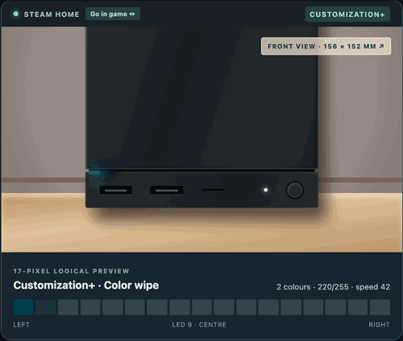
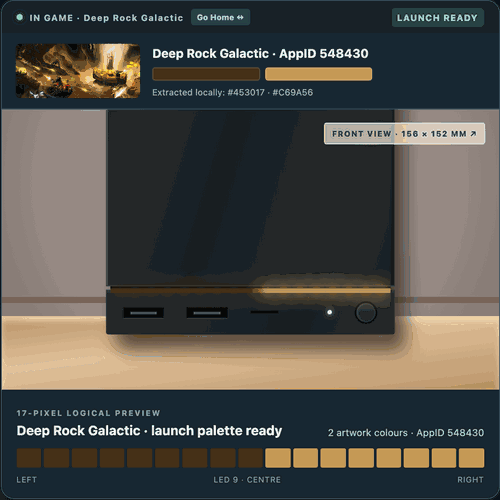
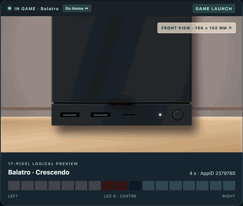

# GabeCubeAura

**Smart status lighting for the official Steam Machine**

Make your Steam Machine's 17-pixel light bar useful and a little more
expressive. Choose separate permanent displays for Home and games, then let
temporary launch, playtime, and Steam moments take the stage before the
selected display returns.

[Download GabeCubeAura v1.0.0](https://github.com/Albusquerque/GabeCubeAura/releases/tag/v1.0.0)

GabeCubeAura is the new name of SignalBar. On first launch it imports an existing
CubeGlow test configuration when present, otherwise it imports the latest
SignalBar settings and artwork caches. Existing users keep their configuration.

[Try the interactive GabeCubeAura preview before installing](https://albusquerque.github.io/gabecubeaura-concept/)

## Your everyday display

### Customization+

Build a permanent Home or in-game display from one, two, or three exact
opaque colours. Use the colour picker, Hex or RGB values, raw 34–255
brightness, 1–100 speed for animated patterns, direction, and a live 17-LED
preview. The 61 existing effect names are grouped by dynamism: Calm & ambient,
Flowing, and Energetic. Alpha is intentionally absent because the LED hardware
and GabeCubeAura settings use RGB, not transparency.

Steam's native Patrol, Breathe, Rainbow, and Solid presets remain in Steam.
Select **GabeCubeAura Off** to use them; GabeCubeAura does not present approximate
lookalikes as if they were Valve's effects.

The animation below moves through two- and three-colour examples at different
speeds. It is captured from the browser simulator, so diffuser appearance may
differ slightly from the physical Steam Machine.



### Artwork

Carry the current game's colours onto the light bar. Choose Library Hero,
Header, or Capsule artwork and select the best row automatically or manually.
The choice is remembered separately for every game.

Local custom artwork is preferred, including SteamGridDB replacements and
images assigned to non-Steam shortcuts. In Artwork mode, the quick Decky panel
shows the active game image directly above its exact 17-colour sample.


### Game launch animations

GabeCubeAura can play a one-shot launch sequence when a new
Steam AppID starts. **Game launches is independent from Artwork display**: it
has its own Hero/Header/Capsule source and colour cache, extracts either two or
three dominant colours locally, offers ten patterns, and uses a 3–45 second
visible timer. Short alerts pause that timer and the sequence resumes after the
alert.

The first animation shows three separate AppIDs and the two- or three-colour
palette extracted from each Library Hero. The second shows five of the ten
available launch patterns. These are browser illustrations generated from the
Concept Lab, not proof of physical LED colour fidelity.





### Performance

Use the bar for CPU, GPU, or both. Mixed mode gives each signal eight LEDs,
with the centre LED off. Length shows load and colour shows temperature.
Responsive, Balanced, and Smooth profiles control how quickly the meter reacts.

Performance can be selected independently for Home, games, or a specific game.
Three ready-made temperature palettes are included, and a native Decky colour
picker lets you choose custom Cool, Middle, and Hot colours.

CPU/GPU sensors are sampled every 0.5 seconds in every display mode. Opening
Performance settings immediately shows fresh readings without first selecting
Performance as the active display. Missing or expired readings are not retained
as if they were live.


### Display routing and temporary layers

Choose one permanent display for Home and another for games: GabeCubeAura Off,
Customization+, Artwork (games only), Performance, Weather, or Controllers. A per-game override
can replace the in-game default. Game launches, Playtime, Light events, and
Controller alerts are separate temporary layers, so they work without forcing
a particular permanent display. Choosing GabeCubeAura Off reproduces the former
Signals-only behaviour: GabeCubeAura yields the bar between temporary signals.

With StripMine v0.1.1-alpha.7 or newer, open **Settings → Compatibility** to
choose which plugin owns the bar for Artwork, Performance, Weather, Controller
displays, Game launches, and Light Events while the mine is active. GabeCubeAura and StripMine
acknowledge every transfer before writing, then restore the previous owner
automatically. No manual **Retry bar** action is required. Playtime countdowns
remain GabeCubeAura priorities; unknown applications still trigger the normal
ownership guard.

### Playtime Countdown

See the time you have left. An active Steam Families limit automatically takes
priority when a game starts, or you can start a personal timer. The bar empties
from right to left, turns amber below 15 minutes, and turns red below five.
During the final eight seconds, three short white flashes repeat until zero.


### Controller battery

See controller charge at a glance. Select Controllers as the permanent Home or
In-game display to show one controller, or split the bar into two mirrored gauges with a dark centre
and white charge tips. Connection and low-battery alerts appear briefly when
Steam reports a change.

Charging can play a short cue or a continuous blue-and-white animation that
stops at 100%. Choose the animation styles, colours, brightness and alert
contexts. The GIF shows the two-controller gauge and continuous charging.


Battery and charging data depend on the controller. Unknown levels are never
invented; see the [controller test notes](docs/CONTROLLERS_RESEARCH.md).

### Weather

Choose a city, then select Weather as the permanent Home or In-game display.
Eighteen selectable loops cover clear skies, rain, cloud,
partly cloudy day and night, snow, and storms. **Snow takes hold** is the
default snow scene; all animations can be previewed without network access.
Cloud has four choices, including **Cross & gather** and the longer **Slow
convergence**, which is the fresh-install default. Existing Cloud selections
are kept.


An optional, experimental weather icon and temperature can also appear beside
the SteamOS clock. Choose °C or °F for the top-bar number. This works
independently of the LED weather scene and has been confirmed on one Steam
Machine; Steam UI updates could change its placement. No temperature colours
are mapped to LEDs.


Select a city before enabling live weather. If you enter a country, use its
full name (for example France), not a two-letter code. GabeCubeAura fetches current
conditions from Open-Meteo about every 15 minutes, without an API key or
automatic location detection. Only one permanent display is selected in each
context; Controllers remains the fresh-install Home default.

## Light events

Light events briefly replace the current display, play their animation, then
restore the selected permanent display. They can work outside a game.
Each category has its own switch, animation selector, and nearby live preview.

### Notification

Return beacon is the fresh-install choice. The GIF below shows Wide echo,
another selectable notification style.


### Screenshot

An icy shutter closes, followed by two flashes with expanding echoes.


### Achievement

Constellation round trip is the fresh-install choice. The GIF below shows it.


### Recording

Two red traces mark recording start and stop. While recording, the centre LED
stays pure red over a compatible permanent display. Its two neighbours are black by
default to keep the marker distinct through the physical diffuser. The marker
never modifies a playtime countdown or another event animation.


## How priorities work

GabeCubeAura follows a strict order:

1. Disabled returns complete control to Steam.
2. Short light/controller alerts may temporarily use a stable bar snapshot; a
   new native LED write cancels them and is never overwritten by a stale frame.
3. Valve/system ownership prevents persistent GabeCubeAura output.
4. The final five minutes of a countdown cancel and outrank Game launches.
5. Short alerts pause a Game launch's visible timer; the launch resumes after
   the alert.
6. Game launches temporarily replace regular countdowns; those countdowns
   return afterwards.
7. The selected permanent Home or In-game display returns after temporary
   layers finish.

## Install

### Decky Loader

1. Install [Decky Loader](https://decky.xyz/).
2. Download `GabeCubeAura-v1.0.0.zip` from the
   [GabeCubeAura v1.0.0 release](https://github.com/Albusquerque/GabeCubeAura/releases/tag/v1.0.0).
   Do not extract it.
3. Open **Decky > Settings > General** and enable **Developer mode** only if the
   **Developer** section is not already visible.
4. Open **Decky > Settings > Developer > Install Plugin from ZIP** and select
   the downloaded archive.
5. Restart Decky Loader if the installed plugin does not appear immediately.

### Manual installation

Extract the archive into `~/homebrew/plugins/` so the result is a
`~/homebrew/plugins/GabeCubeAura/` directory, then restart `plugin_loader`.

GabeCubeAura requests Decky's root flag only because the Steam Machine exposes its
light bar through root-owned `valve-leds` sysfs files.

## First setup

1. Open GabeCubeAura in Decky's quick-access menu.
2. Choose a **Home display** and an **In-game display** under Display routing.
3. Open **Detailed settings** for Artwork, Performance, Weather, Game launches,
   Playtime, Light events, Controllers, Compatibility, and Advanced options.
4. Use Preview to compare animations before changing your live settings.

Live Light events are enabled on a fresh installation. Controller alerts have
their own switch and work independently of Light events. Saved settings from
older versions are kept.

## Configuration

### Artwork

- Library Hero, Header, or vertical Capsule
- Automatic, centre, lower, or manual sample row
- Red line over the image showing the selected manual row
- Saved source and position for each game
- Local SteamGridDB and non-Steam custom artwork support

Steam's Library Logo is not sampled because it is a transparent foreground
layer rather than a complete image.

### Performance

- CPU, GPU, or mixed CPU + GPU
- Both meters left to right, or mirrored toward the centre
- Responsive, Balanced, or Smooth filtering
- Selectable as the Home, In-game, or per-game display
- Three built-in temperature palettes
- Custom Cool, Middle, and Hot colours through Decky's colour picker
- Live CPU/GPU load and temperature in the quick panel

`Cool temperature` and `Hot temperature` are thresholds. The selected colour
palette is blended continuously between them.

### Playtime

- Automatic Steam Families remaining-time signal
- Personal timer from five to 240 minutes
- Five starting colours
- Timer-duration scale or fixed one, two, three, or four-hour full bar
- Final eight-second alert

Steam Families only appears while a game is running. Closing or switching games
clears the old parental countdown immediately.

### Controllers

- Permanent battery gauge selected through Home/In-game display routing
- Brief alert contexts: Off, On Home, In game, or Home + in game
- Connection and low-battery alerts can each be disabled; charging has its own
  Off / Brief / Continuous on Home / Continuous everywhere choice
- Adjustable low-battery threshold from 5% to 30%
- Three selectable styles for each signal, including the two-controller view
- Local preview buttons work without a connected controller or live alerts

The gauge is the permanent display where selected; it does not combine colours
from another display. A Steam Families countdown still wins. Unknown or
coarse battery data is not displayed as an exact percentage.

### Weather

- Location selected manually by city or postal code; no automatic geolocation
- Selectable through Home/In-game routing, with eighteen 17-LED animations
- Independent optional SteamOS top-bar icon and °C/°F temperature
- Weather brightness and faint-pixel cutoff for the physical diffuser
- Weather previews work without a city or network connection

### Optical calibration

The physical diffuser can make a lit LED bleed into a neighbouring dark space.
**Extra dark LEDs** compensates by lighting fewer physical pixels than the
logical preview. It affects Countdown and Performance, never Artwork. The
default is two.

The official Steam Machine's physical LED order is reversed by default while
the Decky preview remains left to right.

### Configuration backup and reset

Open **Advanced / debug > Show debug details** and choose **Export configuration
JSON**. GabeCubeAura writes a readable snapshot of global settings, saved per-game
profiles, and the current game's resolved choices to
`/home/deck/Documents/GabeCubeAura-configuration.json` on a standard SteamOS setup.
The panel always shows the exact path used. Exporting again replaces only that
file, and controller device IDs are never included.

In the same Debug section, **Import configuration JSON** opens a file picker
and asks for confirmation before replacing saved global settings and per-game
profiles. Unsupported or invalid files leave the existing configuration
untouched. **Reset to defaults** asks for confirmation, clears per-game
profiles, and restores the shipped defaults. Neither action deletes the
exported JSON or the artwork cache; both stop a running personal timer.

## Safety and privacy

- No telemetry or cloud account login. Weather city search requests and live
  Open-Meteo requests occur only when you use the optional Weather feature.
- No SteamOS read-only filesystem modification
- Local read-only discovery of Steam and custom-grid artwork
- Serialized and rate-limited hardware writes
- Redundant-frame suppression to reduce unnecessary LED writes
- A userspace guard that yields when Steam or another process changes the bar

GabeCubeAura only restores a previous frame when the hardware still matches its
own last verified write.

## Requirements and known limits

- Designed for the official Steam Machine 17-pixel `valve-leds` light bar
- Requires Decky Loader on SteamOS
- CPU and GPU sensors depend on paths exposed by the hardware and SteamOS build
- Steam notifications and recording use private SteamClient callbacks that may
  change between Steam builds
- Achievement animations follow Steam's achievement notification
- Screenshot animations follow a newly written screenshot file
- Controller battery reporting relies on the private SteamInputManager service
  and varies by controller. There is no verified compatibility list for every
  controller and connection type yet.
- No Internet artwork fallback, audio visualizer, FPS, network, storage,
  Moonlight, or Sunshine provider yet

## Build and test

```bash
npm install
npm test
npm run build
npm run package
```

The installable archive is written to `out/GabeCubeAura-v1.0.0.zip`.

See [the GabeCubeAura 1.0.0 release design](docs/GABECUBEAURA_1.0.0.md)
for the rebrand, Customization+ hierarchy and per-game launch palettes.

See [ARCHITECTURE.md](ARCHITECTURE.md) for provider, arbitration, guard, and
hardware-rendering details. Release history is available in
[CHANGELOG.md](CHANGELOG.md).

## Uninstall and license

Use Decky's plugin settings to uninstall GabeCubeAura. Settings remain in Decky's
normal plugin settings directory and can be removed separately if desired.

GabeCubeAura is released under the [BSD 3-Clause License](LICENSE).
